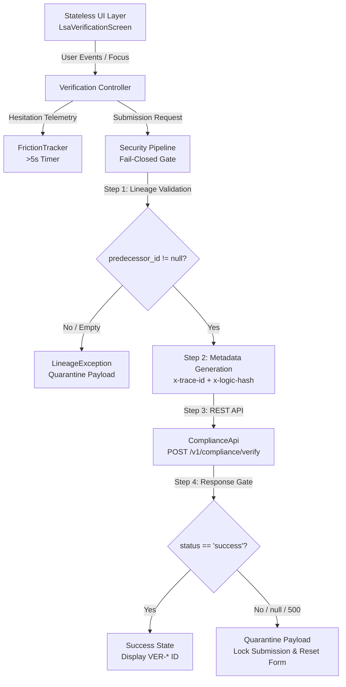

# HabotConnect HPF — Architecture & Engineering Specification

## 1. System Overview

The **HabotConnect LSA Verification & Data Lineage Integration (HPF)** application enforces strict data compliance, deterministic data lineage, fail-closed security gating, and UI friction telemetry within a decoupled, stateless Flutter architecture.



---

## 2. The Byt Principle

The application follows atomic, single-responsibility UI decomposition. Every component (Byt) has a singular, isolated function and contains zero business logic, API calls, or timers.

```text
LsaVerificationScreen (StatelessWidget)
│
├── VerificationHeaderByt   -> Branding, title, and compliance badge
├── StatusBannerByt         -> Real-time lifecycle state (Idle, Processing, Quarantined, Success)
├── LsaIdFieldByt           -> LSA-7049 prefilled text field
├── ParentConsentFieldByt   -> Editable input with FocusNode telemetry
├── PredecessorFieldByt     -> Read-only, system-enforced Data Lineage field
├── VerificationButtonByt   -> "Verify & Submit" CTA with loading/lock indicators
└── SimulationPanelByt      -> Diagnostic scenario preset loader & telemetry inspector
```

---

## 3. Fail-Closed Security Architecture

Under the **Fail-Closed** principle, any validation error, missing security parameter, network failure, or ambiguous response immediately halts processing, isolates the record into quarantine, clears volatile user input, and locks submission. The system never fails open.

### Fail-Closed Execution Pipeline

```text
User Submits
    │
    ▼
[Gate 1: Input Validation]
    ├── Check lsa_id is not empty
    └── Check parent_consent_code is not empty
    │
    ▼
[Gate 2: Data Lineage Gate]
    └── Verify predecessor_id != null && predecessor_id.trim().isNotEmpty
        └── Failure: Throws LineageException -> Quarantine -> STOP
    │
    ▼
[Gate 3: Cryptographic Metadata Generation]
    ├── Generate fresh RFC 4122 UUID v4 (x-trace-id)
    └── Generate deterministic SHA-256 (x-logic-hash)
    │
    ▼
[Gate 4: Outbound REST Transmission]
    └── POST /v1/compliance/verify with JSON body and security headers
    │
    ▼
[Gate 5: Response Validation]
    └── If status == null OR status != 'success' OR HTTP != 200:
        └── Quarantine -> Clear Volatile Form Data -> Lock Submission
```

---

## 4. Data Lineage (`predecessor_id`)

The `predecessor_id` links the current LSA onboarding record back to its ancestral onboarding node. 
- The field is **system-controlled and read-only** in the UI to prevent client tampering.
- If `predecessor_id` is missing or blank, `SecurityService` throws a `LineageException`.
- The exception is trapped by `VerificationController`, transitioning the state to `Quarantined (Fail-Closed)` without initiating any outbound network request.

---

## 5. Metadata Cryptography

Every outbound request includes:
1. **`x-trace-id`**: Fresh dynamic UUID v4 (`UuidUtils.generateTraceId()`) to track and correlate requests across distributed logs.
2. **`x-logic-hash`**: SHA-256 cryptographic digest (`HashUtils.generateLogicHash()`) generated deterministically from `logic_version + schema_version` (`habotconnect_lsa_logic_v1.0:schema_v1.0_2026`).

---

## 6. Friction Tracking (>5-Second Inactivity Rule)

`FrictionTracker` monitors hesitation on the `parent_consent_code` field:
- **Trigger**: Focus on `parent_consent_code` initiates a 5.0-second timer.
- **Reset**: Any user keystroke/interaction resets the 5-second countdown.
- **Event**: If 5 seconds elapse without interaction or submit, a `FrictionEvent` is logged:
  ```text
  [UI_FRICTION_LOG]
  Timestamp: 2026-08-15T12:00:00Z
  Field: parent_consent_code
  Hesitation Duration: 5.2s
  ```
- **Deduplication**: Once triggered during an active focus session, duplicate events are prevented until the field is blurred and refocused.
- **Cancellation**: Blurring the field or submitting the form immediately cancels active timers.
