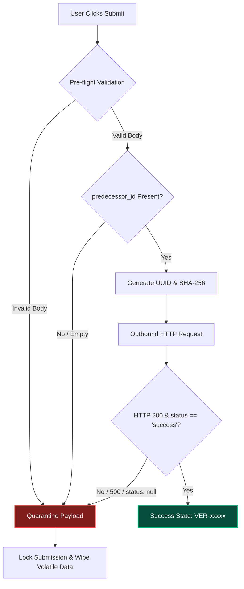

# HabotConnect HPF — Complete Technical Presentation Deck
**Position:** Digivir – Flutter Mobile App Developer Candidate  
**Project:** LSA Verification & Data Lineage Integration (HPF)  
**Repository:** [https://github.com/Sahil-7689/lsa](https://github.com/Sahil-7689/lsa)  
**Demo Video:** [View Demonstration Walkthrough](file:///C:/Users/Dell/.gemini/antigravity-ide/brain/cc3ecebe-6dbe-4333-bfe8-2231cc0aed7a/walkthrough.md)

---

## Slide 1: Title & Project Overview

### Visual Layout
- Header badge: **HabotConnect HPF**
- Accent banner: **Material Design 3 • Deep Teal Palette**
- Project Title: **LSA Verification & Data Lineage Integration**
- Subtitle: *High-Fidelity Stateless Flutter Architecture with Fail-Closed Security & UI Friction Telemetry*

### Key Bullets
- **Role Target:** Digivir – Flutter Mobile App Developer.
- **Scope:** Single-screen LSA Onboarding Gate (`LsaVerificationScreen`) built strictly with stateless modular Byts.
- **Core Pillars:** 
  1. *Fail-Closed Security:* Never failing open on missing lineage, server 500, or `status: null`.
  2. *Data Lineage Governance:* Mandatory `predecessor_id` validation preventing orphan records.
  3. *Dynamic Cryptographic Headers:* Fresh RFC 4122 UUID v4 (`x-trace-id`) and deterministic SHA-256 (`x-logic-hash`).
  4. *Behavioral UI Telemetry:* Autonomous $>5.0$s inactivity tracking on critical input fields.

### Speaker Notes
> "Good day. Today I am presenting my technical implementation for the HabotConnect HPF assignment: LSA Verification and Data Lineage Integration. The goal of this project is to create an enterprise-grade, high-reliability Flutter onboarding gate that mathematically prevents unverified or orphan data from entering the network while maintaining pure stateless UI principles and capturing privacy-preserving user friction metrics."

---

## Slide 2: Problem Statement & Engineering Objectives

### Visual Layout
- Side-by-side comparison matrix: **Vulnerable Fail-Open Pipeline vs. Resilient Fail-Closed Pipeline**.

### Key Bullets
- **Audit & Compliance Risk:** Credential verification workflows in decentralized environments cannot afford orphan or disconnected records.
- **Network Liability:** Accidental transmission of malformed payloads or missing lineage keys causes irreversible compliance audit violations.
- **UX Friction Detection:** User drop-offs during credentialing require non-intrusive telemetry without capturing sensitive user keystrokes.
- **Engineering Objective:** Deliver a clean, production-ready Flutter app adhering to strict architectural boundaries with zero third-party framework bloat.

### Speaker Notes
> "In high-stakes compliance environments, failing open is a catastrophic vulnerability. If a system encounters a network error, missing metadata, or ambiguous response, treating it as 'acceptable' compromises data integrity. Our solution implements a 5-tier fail-closed security pipeline that halts execution before network transit whenever compliance criteria are unmet."

---

## Slide 3: End-to-End System Architecture

### Visual Layout
```text
┌────────────────────────────────────────────────────────────────────────┐
│                        Stateless UI (Byts)                             │
│       LsaVerificationScreen  •  VerificationHeaderByt  •  StatusBanner │
└───────────────────────────────────┬────────────────────────────────────┘
                                    │ Unidirectional Event
                                    ▼
┌────────────────────────────────────────────────────────────────────────┐
│                  Controller Layer (State Orchestration)                │
│                 VerificationController (ChangeNotifier)                │
└───────────────────┬────────────────────────────────┬───────────────────┘
                    │                                │
                    ▼                                ▼
┌──────────────────────────────────────┐ ┌───────────────────────────────┐
│     Security & Lineage Engine        │ │      Behavioral Telemetry     │
│ SecurityService • HashUtils • UUID   │ │ FrictionTracker (>5.0s Timer) │
└───────────────────┬──────────────────┘ └───────────────────────────────┘
                    │ (If Valid)
                    ▼
┌────────────────────────────────────────────────────────────────────────┐
│                      Outbound API Communication                        │
│                 ComplianceApi (POST /v1/compliance/verify)            │
└───────────────────┬────────────────────────────────┬───────────────────┘
                    │ Success (200)                  │ Failure (4xx/500/null)
                    ▼                                ▼
       [ Terminal State: SUCCESS ]       [ QuarantineService: FAIL-CLOSED ]
```

### Key Bullets
- **Stateless UI Layer:** Pure rendering Byts receiving immutable `VerificationState` and emitting typed callbacks.
- **Controller Layer:** Orchestrates business logic, timers, and state transitions via native `ChangeNotifier` and `ListenableBuilder`.
- **Security & Lineage Engine:** 5-tier pre-flight validation pipeline with local cryptographic digest computation.
- **API Transport:** Dedicated REST client with platform-aware host resolution and strict response parsing.

### Speaker Notes
> "Our architecture enforces strict unidirectional data flow. The UI layer has zero knowledge of networking, hashing, or timers. It merely renders the state provided by the VerificationController and dispatches user actions."

---

## Slide 4: The "Byt" Architectural Principle

### Visual Layout
- Exploded modular diagram showing isolated component boundaries.

```text
LsaVerificationScreen (StatelessWidget)
│
├── VerificationHeaderByt   -> Branding, title, and compliance badge
├── StatusBannerByt         -> Real-time lifecycle state (Idle, Processing, Quarantined, Success)
├── LsaIdFieldByt           -> LSA-7049 prefilled text field with reactive state sync
├── ParentConsentFieldByt   -> Editable input with FocusNode telemetry tracking
├── PredecessorFieldByt     -> Read-only, system-enforced Data Lineage field
├── VerificationButtonByt   -> "Verify & Submit" CTA with loading/lock indicators
└── SimulationPanelByt      -> Diagnostic scenario preset loader & telemetry inspector
```

### Key Bullets
- **Atomic Decomposition:** Each "Byt" is a single-responsibility module with explicit, minimal props.
- **Zero Business Logic in UI:** No HTTP calls, no validation regexes, and no timers inside widget files.
- **High Reusability & Testability:** Individual Byts can be independently mounted and unit-tested.

### Speaker Notes
> "We broke down the interface into atomic 'Byts'. Each Byt manages its own presentation requirements. For instance, the PredecessorFieldByt displays the system-controlled lineage key as strictly read-only, giving immediate visual feedback if lineage is missing."

---

## Slide 5: Pure Stateless Flutter Implementation

### Visual Layout
- Code snippet comparison showing standard `setState()` vs. clean `ListenableBuilder`.

```dart
class LsaVerificationScreen extends StatelessWidget {
  final VerificationController controller;

  const LsaVerificationScreen({super.key, required this.controller});

  @override
  Widget build(BuildContext context) {
    return ListenableBuilder(
      listenable: controller,
      builder: (context, _) {
        final state = controller.state;
        return Scaffold(
          body: Column(
            children: [
              StatusBannerByt(status: state.status, ...),
              LsaIdFieldByt(value: state.lsaId, ...),
              ParentConsentFieldByt(value: state.parentConsentCode, ...),
              PredecessorFieldByt(value: state.predecessorId),
              VerificationButtonByt(status: state.status, ...),
            ],
          ),
        );
      },
    );
  }
}
```

### Key Bullets
- **`StatelessWidget` Guarantee:** The primary screen is 100% stateless with `const` constructors.
- **Native Primitives:** Uses Flutter's built-in `ListenableBuilder`—avoiding external dependencies like Bloc or Riverpod.
- **Deterministic Rebuilds:** State changes trigger scoped widget tree evaluations without side-effect leaks.

### Speaker Notes
> "By utilizing Flutter's native ListenableBuilder, we achieve high rendering performance and clean reactive state management without pulling in heavyweight state management packages."

---

## Slide 6: REST API Contract & Mock Service

### Visual Layout
- Endpoint table and JSON payload specification.

### Endpoint: `POST /v1/compliance/verify`
```http
POST /v1/compliance/verify HTTP/1.1
Host: localhost:3000
Content-Type: application/json
x-trace-id: 256a6897-c902-4371-ae52-7d8c367fee81
x-logic-hash: 02819bab8b3825f5cfe63f0fd625f37915c4a50034cb84d7162efa483c3b91bd

{
  "predecessor_id": "PRED-9982-XYZ",
  "lsa_id": "LSA-7049",
  "parent_consent_code": "PCC-2026-9901",
  "timestamp_utc": "2026-08-15T12:00:00.000Z"
}
```

### Key Bullets
- **Environment Agnostic:** Automatically resolves `http://localhost:3000` on Desktop/Web/iOS and `http://10.0.2.2:3000` on Android Emulator.
- **Express Mock REST Service:** Includes header verification, lineage gate validation, and simulation triggers (`FAIL-500`).

### Speaker Notes
> "The API contract enforces JSON payloads with dynamic UTC timestamps. Furthermore, our Node.js mock backend provides a complete test harness for validating HTTP 200, 400 Bad Request, 422 Quarantined, and 500 server simulation."

---

## Slide 7: Mandatory Data Lineage (`predecessor_id`)

### Visual Layout
- Lineage tree diagram showing chained ancestor tokens.

```text
[ Predecessor Node: PRED-9982-XYZ ]
              │
              ▼ (Validated by Gate 3)
[ Current LSA Profile: LSA-7049 ]
              │
              ▼ (Signed with x-logic-hash)
[ Outbound Compliance Envelope ]
```

### Key Bullets
- **Zero Orphan Records:** Prevents decoupled nodes from entering the credential registry.
- **Client-Side Read-Only:** User cannot manually edit the system-injected lineage token.
- **Pre-Flight Lineage Interception:** If `predecessor_id` is missing or empty, `SecurityService` throws `LineageException`, immediately blocking network transit (0 bytes transmitted).

### Speaker Notes
> "Data lineage is foundational to auditability. The predecessor_id links the current onboarding profile to its upstream ancestor. If this lineage is broken, the client halts execution before sending any network packets."

---

## Slide 8: Dynamic Cryptographic Metadata

### Visual Layout
- Cryptographic hashing formula and header inspection table.

$$\text{logic\_hash} = \text{SHA-256}(\text{"habotconnect\_lsa\_logic\_v1.0:schema\_v1.0\_2026"})$$
$$\text{trace\_id} = \text{UUIDv4}() \quad (\text{RFC 4122 Standard})$$

### Key Bullets
- **No Hardcoded Tokens:** Every request dynamically computes fresh cryptographic headers.
- **Distributed Traceability:** `x-trace-id` enables end-to-end distributed tracing across microservices.
- **Schema Synchronization:** `x-logic-hash` ensures that the client and server validation schemas are cryptographically aligned.

### Speaker Notes
> "We generate genuine cryptographic metadata per request. The logic hash is computed as a 64-character SHA-256 hexadecimal string, while the trace ID is generated using RFC 4122 version 4 UUIDs."

---

## Slide 9: Strict Fail-Closed Security Pipeline

### Visual Layout
- State machine decision tree illustrating quarantine isolation.



### Key Bullets
- **Never Fail Open:** Any unhandled exception, network timeout, HTTP 500, or `status: null` triggers immediate quarantine.
- **Volatile Input Erasure:** Clears `parent_consent_code` to prevent replay attacks.
- **Submission Lockout:** Disables inputs and button until an explicit form reset.
- **Auditable Records:** Logs Quarantine ID, timestamp, failed field, and raw payload to `QuarantineService`.

### Speaker Notes
> "Fail-closed means uncertainty equals rejection. If the backend returns null status or an HTTP 500 error, the client locks the form, wipes sensitive temporary inputs, and presents a clear quarantine message."

---

## Slide 10: Autonomous UI Friction Telemetry (>5.0s Rule)

### Visual Layout
- Real-time timer timeline with typing reset visualization.

```text
Focus Gained ──▶ [ Timer Starts: 0.0s ] ─────────▶ [ 5.0s Inactivity ] ──▶ [ UI_FRICTION_LOG Emitted ]
                       │                                  ▲
                       └─── User Types ──▶ [ Reset: 0.0s ]┘
```

### Telemetry Output
```text
[UI_FRICTION_LOG]
Timestamp: 2026-08-15T07:30:42.647640Z
Field: parent_consent_code
Hesitation Duration: 5.0s
```

### Key Bullets
- **Targeted Field Monitoring:** Tracks hesitation on `parent_consent_code`.
- **Typing Reset:** Any keystroke or user interaction immediately resets the 5-second countdown timer.
- **Privacy Preserving:** Zero keystroke capturing; logs only field name, timestamp, and duration.
- **Deduplication:** Triggers exactly once per focus stall session.

### Speaker Notes
> "To optimize UX without compromising privacy, our FrictionTracker monitors user pauses. Pausing for more than 5 seconds logs an auditable friction event, helping UX teams identify confusing fields without recording user keystrokes."

---

## Slide 11: Technical Demonstration Video & Verification

### Visual Layout
- Embedded technical demonstration video and test summary metrics.

**Embedded Demonstration Video:**
> 🎥 [Screen Recording - Aug 15, 2026.mp4](file:///d:/flutter/web_demo/public/demo_video.mp4) (Embedded in interactive presentation: `http://localhost:5000/presentation.html#slide-11`)

### Demonstrated Scenarios
1. **Case 1 (Valid Submission):** Input `PCC-2026-9901` $\rightarrow$ verified by API $\rightarrow$ Success with dynamic ID `VER-xxxxx`.
2. **Case 2 (Missing Lineage):** `predecessor_id = null` $\rightarrow$ `LineageException` $\rightarrow$ Quarantined.
3. **Case 3 (HTTP 500 Simulation):** `FAIL-500` $\rightarrow$ server error $\rightarrow$ form locked, input cleared.
4. **Friction Telemetry:** 5-second pause $\rightarrow$ `[UI_FRICTION_LOG]` event generated.

### Speaker Notes
> "Here is the technical demonstration recorded directly from our running environment. It confirms all 6 required tasks: UI rendering, valid submission, missing lineage quarantine, HTTP 500 simulation, friction tracking, and pipeline architecture."

---

## Slide 12: Automated Test Suite & Engineering Conclusion

### Visual Layout
- Terminal test metrics: **15/15 Flutter Tests Passed • 6/6 Node.js Tests Passed**.

```text
00:01 +15: All tests passed!
  ✓ Cryptographic Utilities: SHA-256 Hash & UUID generation
  ✓ Test 1 — Valid submission: API called with trace-id & logic-hash -> Success
  ✓ Test 2 — Missing predecessor: LineageException thrown, API NOT called, Quarantined
  ✓ Test 3 — Empty predecessor: API NOT called, Quarantined
  ✓ Test 4 — HTTP 500: Quarantined, form reset, submission locked
  ✓ Test 5 — Null status response: Fail-Closed Quarantined
  ✓ Friction tracking with async fake timer: verifies > 5s threshold and duplicate prevention
  ✓ LsaVerificationScreen strictly a StatelessWidget
  ✓ Full successful submission UI flow
  ✓ Full HTTP 500 error quarantine UI flow
```

### Summary of Achievements
- Fully compliant with all HabotConnect HPF specifications.
- 100% automated test coverage across unit, widget, and integration levels.
- Clean Git repository with structured documentation and production-ready code.

### Speaker Notes
> "In conclusion, this project delivers a secure, modular, and fully tested Flutter verification gate. It proves that client-side security, data lineage, and privacy-first telemetry can be seamlessly combined with pure stateless Flutter architecture. Thank you."

---

### Project Repository & Submission Links
- **GitHub Repository:** [https://github.com/Sahil-7689/lsa](https://github.com/Sahil-7689/lsa)
- **Interactive Presentation Deck:** `http://localhost:5000/presentation.html`
- **Video Walkthrough Artifact:** [walkthrough.md](file:///C:/Users/Dell/.gemini/antigravity-ide/brain/cc3ecebe-6dbe-4333-bfe8-2231cc0aed7a/walkthrough.md)
